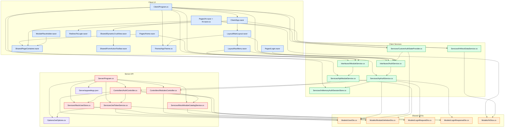

# System Mind Map

```mermaid
graph TD
    subgraph Client_UI[Client UI]
        CProgram["Client/Program.cs"]
        CApp["Client/App.razor"]
        MainLayout["Layout/MainLayout.razor"]
        NavMenu["Layout/NavMenu.razor"]
        Login["Pages/Login.razor"]
        Home["Pages/Home.razor"]
        Hr["Pages/Hr.razor + Hr.razor.cs"]
        PageContainer["Shared/PageContainer.razor"]
        DynamicCrud["Shared/DynamicCrudView.razor"]
        Toolbar["Shared/FormActionToolbar.razor"]
        Placeholder["ModulePlaceholder.razor"]
        Redirect["RedirectToLogin.razor"]
        Theme["Theme/AppTheme.cs"]
    end

    subgraph Client_Services[Client Services]
        AuthContract["Interfaces/IAuthService.cs"]
        ModuleContract["Interfaces/IModuleService.cs"]
        ApiAuth["Services/ApiAuthService.cs"]
        ApiModules["Services/ApiModuleService.cs"]
        AuthProvider["Services/CustomAuthStateProvider.cs"]
        SessionStore["Services/InMemoryAuthSessionStore.cs"]
        HrMock["Services/HrMockDataService.cs"]
    end

    subgraph Server_API[Server API]
        SProgram["Server/Program.cs"]
        AuthController["Controllers/AuthController.cs"]
        ModulesController["Controllers/ModulesController.cs"]
        JwtSvc["Services/JwtTokenService.cs"]
        UserStore["Services/MockUserStore.cs"]
        ModuleCatalog["Services/MockModuleCatalogService.cs"]
        JwtOptions["Options/JwtOptions.cs"]
        ServerConfig["Server/appsettings.json"]
    end

    subgraph Shared_DTOs[Shared DTOs]
        UserDto["Models/UserDto.cs"]
        ModuleDto["Models/ModuleDefinitionDto.cs"]
        LoginReq["Models/LoginRequestDto.cs"]
        LoginRes["Models/LoginResponseDto.cs"]
        HrDtos["Models/HrDtos.cs"]
    end

    CProgram --> CApp
    CProgram --> AuthContract
    CProgram --> ModuleContract
    CProgram --> ApiAuth
    CProgram --> ApiModules
    CProgram --> AuthProvider
    CProgram --> SessionStore
    CProgram --> HrMock
    CProgram --> Theme

    CApp --> MainLayout
    CApp --> Redirect
    CApp --> AuthProvider

    MainLayout --> NavMenu
    MainLayout --> AuthContract
    MainLayout --> Theme

    NavMenu --> ModuleContract
    NavMenu --> AuthContract
    Home --> ModuleContract
    Home --> PageContainer
    Login --> AuthContract
    Hr --> PageContainer
    Hr --> DynamicCrud
    Hr --> HrMock
    Hr --> HrDtos
    DynamicCrud --> Toolbar
    Placeholder --> PageContainer

    AuthContract --> ApiAuth
    ModuleContract --> ApiModules
    ApiAuth --> SessionStore
    ApiAuth --> AuthController
    ApiAuth --> LoginReq
    ApiAuth --> LoginRes
    ApiAuth --> UserDto
    AuthProvider --> AuthContract
    AuthProvider --> UserDto
    ApiModules --> ModulesController
    ApiModules --> ModuleDto
    HrMock --> HrDtos

    SProgram --> AuthController
    SProgram --> ModulesController
    SProgram --> JwtSvc
    SProgram --> UserStore
    SProgram --> ModuleCatalog
    SProgram --> JwtOptions
    SProgram --> ServerConfig

    AuthController --> UserStore
    AuthController --> JwtSvc
    AuthController --> LoginReq
    AuthController --> LoginRes
    AuthController --> UserDto

    ModulesController --> ModuleCatalog
    ModulesController --> ModuleDto

    JwtSvc --> JwtOptions
    JwtSvc --> LoginRes
    JwtSvc --> UserDto
    UserStore --> UserDto
    ModuleCatalog --> ModuleDto

    classDef ui fill:#dbeafe,stroke:#2563eb,stroke-width:1.5px,color:#0f172a
    classDef service fill:#dcfce7,stroke:#16a34a,stroke-width:1.5px,color:#0f172a
    classDef api fill:#fee2e2,stroke:#dc2626,stroke-width:1.5px,color:#0f172a
    classDef dto fill:#ffedd5,stroke:#f97316,stroke-width:1.5px,color:#0f172a
    classDef config fill:#ede9fe,stroke:#7c3aed,stroke-width:1.5px,color:#0f172a

    class CProgram,CApp,MainLayout,NavMenu,Login,Home,Hr,PageContainer,DynamicCrud,Toolbar,Placeholder,Redirect,Theme ui
    class AuthContract,ModuleContract,ApiAuth,ApiModules,AuthProvider,SessionStore,HrMock service
    class SProgram,AuthController,ModulesController,JwtSvc,UserStore,ModuleCatalog api
    class UserDto,ModuleDto,LoginReq,LoginRes,HrDtos dto
    class JwtOptions,ServerConfig config
```
